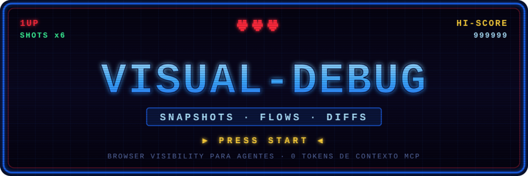

<p align="center">
  
</p>

<p align="center">
  <a href="https://github.com/Jcibernet/visual-debug/releases"></a>
  <a href="LICENSE"></a>
  
  
  
</p>

# visual-debug

> El ojo crítico UI/UX para agentes de código. Inspecciona, mide, compara — sin acumular basura en el repo.

Este README está escrito para vos, agente (Claude Code, Droid, Cursor). Es la
documentación que leés cuando encontrás `visual-debug` dentro de un proyecto.
Instrucciones directas, sin vueltas.

`visual-debug` es un CLI de un solo archivo que te deja **ver y operar** una app
web corriendo, sin un servidor Playwright MCP (y los ~3.500 tokens de contexto
que cuesta). Corre por shell, todo el estado queda en disco, y vos leés JSON +
SVG con `cat`/`jq`.

La salida estrella **no es un screenshot**. Es un **layout SVG** (vector) + un
**uxReport** (heurísticas de geometría y accesibilidad). Leés texto estructurado,
no píxeles. Los PNG/JPEG son opt-in.

---

## Novedades v0.3.0

Si ya conocés v0.2.0, lo que cambió:

- **Efímero por default.** Una corrida vive en un tmp dir y se borra al salir.
  Ya **no** se escribe `.visual-debug/` en el repo salvo que lo pidas. La ruta
  del run temporal se imprime en **stderr**.
- **Los PNG ya no se generan por default.** Para juzgar UI leé el `.layout.svg`
  y el `uxReport` — son texto y cuestan una fracción de tokens. Pedí raster solo
  con `--screenshots` o `--screenshot-on-issue`.
- **Persistir es opt-in y semántico**: `--persist-as <nombre>`, no acumulación
  por timestamp.
- **Pipeable**: `--emit-manifest` manda el manifest a stdout; `--diff-against`
  acepta `-` (stdin).
- El JSON viejo no cambió. Solo se agregaron campos (`layout`, `uxReport`,
  `layoutSvg`) y categorías de diff (`layout`, `ux`). Todo es back-compat.

---

## Qué hace

Tres modos + un subcomando de mantenimiento:

1. **URL** — `visual-debug <url>`: snapshot one-shot. Page map + layout SVG +
   uxReport (+ devtools dump: console, network, a11y, perf).
2. **Flow** — `visual-debug --flow -`: recetas multi-paso que armás inline y
   pipeás por stdin. Clickeás, llenás forms, navegás, y snapshoteás en cualquier
   paso.
3. **Diff** — `visual-debug --diff a b`: compara dos manifests y devuelve un
   veredicto (`regression`/`changed`/`neutral`) con exit codes para tu loop.
4. **Runs** — `visual-debug runs ...`: mantenimiento destructivo de runs
   persistidos (listar, prunear, limpiar). Vive aparte para no dispararse solo.

---

## Cuándo usarlo (decision tree)

```
¿Solo querés inspeccionar una vista?
  → URL mode:  visual-debug <url>

¿Tenés que navegar/interactuar antes de ver el estado (login, form, tab)?
  → Flow mode: armá el JSON inline y pipealo por stdin con --flow -

¿Estás iterando sobre un cambio y querés saber si rompiste algo?
  → snapshot baseline (--emit-manifest > base.json)
    → editás el código
    → snapshot nuevo | --diff-against base.json -
    → leés el verdict

¿Vas a hacer un refactor grande y querés un baseline nombrado?
  → --persist-as <nombre>  (único caso donde conviene persistir)
```

---

## Instalación

Requiere **Node 18+**.

```bash
npm i -g @jcibernet/visual-debug
```

La primera corrida descarga Chromium vía Playwright (~170MB). Si ya tenés uno,
apuntá `--executable <path>` o la env var `VISUAL_DEBUG_CHROMIUM` a tu binario.

**Primer comando, copy-paste, funciona sin setup previo:**

```bash
visual-debug https://example.com --emit-manifest | jq '.summary, .actions[0:3]'
```

Eso corre efímero (no escribe nada en el repo), te da el manifest por stdout, y
con `jq` ves el resumen y los primeros interactuables. El tmp dir se borra solo.

---

## Modo URL — inspección puntual

```bash
# Efímero (default). La ruta del tmp dir va a stderr.
visual-debug http://localhost:3000/app

# Manifest a stdout para parsear con jq (resumen va a stderr):
visual-debug http://localhost:3000/app --emit-manifest | jq '.uxReport | keys'
```

Flags útiles:

```bash
--viewport 375x812      # o --device "iPhone 14" para mobile
--dark                  # dark colorScheme
--wait "[selector]"     # esperá a que aparezca algo antes de capturar
--auth-storage <path>   # storageState de Playwright (sesión logueada)
--full-page             # solo afecta el raster (si lo activás)
```

---

## Modo flow — recetas multi-paso vía stdin

Cuando hay que clickear, llenar forms o llegar a un estado antes de snapshotear.
Armá el JSON inline y pipealo:

```bash
echo '{
  "name": "verify",
  "baseUrl": "http://localhost:3000",
  "steps": [
    { "navigate": "/app" },
    { "snapshot": "inicial" },
    { "click": { "ref": 7 } },
    { "wait": "[data-step=detail]" },
    { "snapshot": "detalle" }
  ]
}' | visual-debug --flow - --emit-manifest
```

**Targeting** (en orden de preferencia):

```jsonc
{ "click": { "ref": 7 } }                          // por índice del page map
{ "click": { "role": "button", "name": "Pay" } }   // por rol + nombre accesible
{ "click": { "text": "Continuar" } }               // por texto visible
{ "click": { "testId": "submit" } }                // por data-testid
{ "click": "[data-action=pay]" }                   // selector CSS crudo
```

Los `ref` salen del array `actions` del snapshot anterior. Se recalculan contra
el DOM **actual** en cada step, así que no quedan stale tras re-renders.

Acciones: `navigate`, `wait`, `snapshot`, `click`, `fill`, `type`, `press`,
`select`, `hover`, `scroll`, `eval`, `pause`. Por step: `optional: true`; por
flow: `continueOnError: true`.

Para activar raster solo en un snapshot puntual: `{ "snapshot": "x", "screenshot": true }`.

---

## Modo diff — verificar que un cambio no rompió nada

```bash
# Forma clásica (dos archivos):
visual-debug --diff baseline.json after.json --fail-on console,network,layout,ux

# Forma pipeable (el candidate viene del stdin):
visual-debug http://localhost:3000/app --emit-manifest \
  | visual-debug --diff-against baseline.json - --fail-on layout,ux
echo "exit=$?"
```

- `verdict: neutral` → sin cambio relevante.
- `verdict: changed` → hubo delta (layout/dom/perf/screenshot) sin errores ni
  findings UX nuevos.
- `verdict: regression` → aparecieron errores de consola, requests fallidos, o
  findings UX nuevos.
- **Exit code `1`** si dispara alguna categoría de `--fail-on`. Categorías
  válidas: `console`, `network`, `perf`, `dom`, `screenshot`, `layout`, `ux`,
  `any`. Default: `console,network`. Usá `any` para modo estricto.

---

## Outputs: qué leer y qué ignorar

> **REGLA CENTRAL: leé el manifest, el layout SVG y el uxReport. NO cargues el
> PNG/JPEG en contexto** salvo que `--screenshot-on-issue` te haya generado uno
> para un finding `severity:'error'` puntual. El SVG + uxReport te dan el layout
> y los problemas en texto, a una fracción del costo en tokens de una imagen.

### Manifest

El índice de todo. Empezá por acá. Trae embebido lo que necesitás para decidir
el próximo paso sin abrir otros archivos:

```bash
visual-debug <url> --emit-manifest | jq '.summary, .actions, .uxReport.tinyTapTargets'
```

- `summary` — conteos rápidos (interactables, console errors, network failed,
  uxFindings por heurística).
- `actions` — los primeros 50 interactuables con `ref`/`role`/`name`/`selector`.
- `layout` — geometría self-contained (para diffear).
- `uxReport` — las heurísticas (ver abajo).
- `outputs` — rutas a los archivos del run (en tmp si es efímero).

### Page map (`<name>.map.json`)

Inventario completo de interactuables, forms, landmarks y headings, cada uno con
`ref` estable, `role`, `name` accesible, `selector` robusto y `bbox`. El
manifest ya embebe los primeros 50 en `actions`; abrí el map solo si necesitás
más de 50 o los forms/landmarks completos.

### Layout SVG (`<name>.layout.svg`)

La feature estrella. Representación **vectorial** del layout, generada del page
map + bounding boxes (sin rasterizar). Leelo con Read: es texto, lo "ves" sin
gastar tokens de imagen.

- Un `<rect>` por interactuable, posicionado por su bbox, con `data-ref`,
  `data-role`, `data-name`.
- Color por familia de rol: inputs azul, buttons verde, links violeta.
- Landmarks como regiones de fondo; headings como rects con label.
- Los elementos flaggeados por las heurísticas tienen **borde rojo punteado** y
  un atributo `data-issue` con los códigos. Buscá `data-issue=` en el SVG para
  saltar directo a lo problemático.

### uxReport (heurísticas)

Objeto en el manifest. Cada heurística es un array de
`{ ref?, selector?, code, message, severity }`. Los collectors corren en
try/catch; los fallos van a `uxReport.errors[]` y nunca rompen la corrida.

Geometría:

| Código | Qué detecta |
|---|---|
| `overflow` | el documento desborda horizontal/vertical |
| `offscreen` | interactuables fuera del viewport |
| `tinyTapTargets` | targets < 44×44 (WCAG 2.5.5) |
| `overlaps` | interactuables que se solapan >50% (z-index/stacking) |
| `truncatedText` | texto cortado con `text-overflow: ellipsis` |

Accesibilidad:

| Código | Qué detecta |
|---|---|
| `unlabeledInputs` | fields sin `<label>`/`aria-label`/`aria-labelledby` |
| `unnamedButtons` | botones/links con nombre accesible vacío |
| `headingOrderJumps` | saltos de nivel (h2 → h4) |
| `missingLandmarks` | falta `<main>`, `<nav>` o `<header>` |
| `imagesWithoutAlt` | `` sin atributo `alt` (`alt=""` es válido) |
| `lowContrastPairs` | contraste WCAG < 4.5:1 (texto normal) o < 3:1 (grande) |

### Screenshot (opt-in, normalmente NO)

Apagado por default. Activalo solo si lo necesitás de verdad:

```bash
--screenshots            # raster en todos los snapshots
--screenshot-on-issue    # raster SOLO si hay un finding severity:'error'
--screenshot-format webp # default; cae a jpeg q70 en Playwright 1.x
```

Si no hay un PNG/JPEG en `outputs.screenshot`, **no lo busques**: no se generó a
propósito. Leé el SVG.

---

## Efímero vs persistente

**Sesgo fuerte hacia efímero.** Un run es una conversación con la página, no un
artefacto permanente.

```bash
# Efímero (default): vive en tmp, se borra al salir. No toca el repo.
visual-debug <url>

# Persistente nombrado: SOLO para baselines de un trabajo largo.
visual-debug <url> --persist-as login-baseline

# Persistente auto-nombrado, con retención (default --keep 1):
visual-debug <url> --persist --keep 3
```

Cuándo persistir (`--persist-as`):

- Vas a hacer un **refactor grande** y querés un baseline para comparar después.
- Querés **capturar un estado roto reproducible** para un bug report
  (combinalo con `--screenshot-on-issue`).

Cuándo **NO** persistir:

- "Por las dudas". No. Usá efímero.
- En cada save de archivo. No.

`--persist-as <nombre>` sobreescribe el dir si ya existe (vos lo nombraste, vos
sos dueño). Lo persistido va a `.visual-debug/<nombre>/` — agregá `.visual-debug/`
al `.gitignore` (no lo commitees).

---

## Subcomando runs

Mantenimiento de runs persistidos. **Destructivo**, por eso vive bajo un
subcomando: nunca se dispara por accidente.

```bash
# Listar runs persistidos, con chequeo fresh/stale/unknown.
# (re-snapshotea la URL del manifest y compara contra el page map guardado)
visual-debug runs --list

# Borrar runs cuyo DOM ya no matchea el baseline (no toca los 'unknown').
visual-debug runs --prune-stale --yes

# Borrar runs más viejos que una duración (7d, 12h, 30m).
visual-debug runs --prune-older-than 7d --yes

# Borrar TODO lo persistido.
visual-debug runs --clean --yes
```

Sin `--yes` te pide confirmación interactiva (y se niega si no hay TTY).

---

## Contratos JSON (campos con garantías de estabilidad)

Todo campo marcado **stable** es API: no se renombra ni se elimina entre minors.

### Manifest de snapshot (`type: "snapshot"`)

| Campo | Estable | Descripción |
|---|---|---|
| `type` | ✅ | `"snapshot"` |
| `name` | ✅ | basename del run |
| `url` / `finalUrl` | ✅ | URL pedida / URL final tras redirects |
| `title` | ✅ | `<title>` de la página |
| `viewport` | ✅ | `[width, height]` |
| `outputs` | ✅ | rutas a archivos del run (`dom`, `console`, `network`, `a11y`, `perf`, `pageMap`, `layoutSvg`, `screenshot`) |
| `summary` | ✅ | conteos: `console`, `network`, `perf`, `pageMap`, `uxFindings` |
| `actions[]` | ✅ | primeros 50 interactuables: `{ ref, role, name, selector }` |
| `layout` | ✅ (v0.3) | `{ viewport, elements:[{ref,role,name,bbox}], landmarks }` |
| `layoutSvg` | ✅ (v0.3) | ruta al `.layout.svg` |
| `uxReport` | ✅ (v0.3) | heurísticas (ver tabla arriba) + `errors[]` |
| `manifestPath` | ✅ | ruta al manifest en disco |

### uxReport finding

| Campo | Estable | Descripción |
|---|---|---|
| `code` | ✅ | identificador de la heurística |
| `message` | ✅ | descripción humana |
| `severity` | ✅ | `'info'` \| `'warn'` \| `'error'` |
| `ref` | ✅ | ref del interactuable (si aplica) |
| `selector` | ✅ | selector CSS (si aplica) |

### Diff (`type: "diff"`)

| Campo | Estable | Descripción |
|---|---|---|
| `verdict` | ✅ | `'neutral'` \| `'changed'` \| `'regression'` |
| `flags` | ✅ | booleanos por categoría: `console`, `network`, `perf`, `dom`, `screenshot`, `layout`, `ux`, `any` |
| `console` | ✅ | `{ newErrors[], fixed[] }` |
| `network` | ✅ | `{ newFailures[], totalDelta }` |
| `perf` | ✅ | `{ fcpDelta, loadDelta }` |
| `dom` | ✅ | `{ added, removed, mutated }` |
| `layout` | ✅ (v0.3) | `{ added, removed, moved, movedRefs[] }` |
| `ux` | ✅ (v0.3) | `{ newFindings[], resolved[], newCount, resolvedCount }` |
| `summaryLine` | ✅ | one-liner del diff |

### Page map (`<name>.map.json`)

| Campo | Estable | Descripción |
|---|---|---|
| `interactables[]` | ✅ | `{ ref, role, name, selector, value, checked, disabled, bbox }` |
| `forms[]` | ✅ | `{ selector, action, method, fields[] }` |
| `landmarks[]` | ✅ | `{ role, selector, name, bbox }` |
| `headings[]` | ✅ | `{ level, text, selector, bbox }` |

---

## Costos de tokens aproximados

| Output | Tamaño típico | ¿Leer? |
|---|---|---|
| **manifest** | ~5–20 KB | **SÍ** — empezá acá |
| **layout SVG** | ~10–50 KB | **SÍ** — para juzgar layout |
| **uxReport** (dentro del manifest) | ~1–5 KB | **SÍ** — para problemas UX/a11y |
| page map | ~5–30 KB | solo si necesitás >50 interactuables |
| PNG/JPEG | ~100–500 KB | **NO** — salvo `--screenshot-on-issue` con error |

**Recomendación: preferí SVG + uxReport, saltá el PNG.** Una imagen de 300KB en
contexto cuesta órdenes de magnitud más que el SVG vectorial que dice lo mismo
en texto.

---

## Limitaciones conocidas

- **Layout SVG ≠ render fiel.** Es la *geometría* de los interactuables y
  landmarks, no los pixeles. No detecta problemas de color/imagen/tipografía más
  allá de lo que cubren las heurísticas. Para eso puntual, `--screenshots`.
- **Contraste WCAG es aproximado.** Calcula luminancia relativa sobre
  color/background-color computados, resolviendo el primer ancestro con fondo
  opaco. No maneja gradientes, imágenes de fondo ni `mix-blend-mode`.
- **WebP cae a JPEG.** Playwright 1.x no emite WebP; `--screenshot-format webp`
  usa JPEG q70 con un aviso por stderr.
- **`overlaps` se limita** a los primeros 250 interactuables por costo O(n²).
- **El chequeo fresh/stale de `runs --list`** re-snapshotea la URL del manifest;
  si la app no está corriendo, el run queda `unknown` (y `--prune-stale` no lo
  toca).
- **No reemplaza a Playwright MCP** en flujos profundamente interactivos paso a
  paso dentro de un mismo turno. Sí es el default más barato para inspección,
  navegación por flow, regresión y auditoría UX.

---

## Cómo funciona

`visual-debug.js` es un único archivo ESM sobre Chromium headless de Playwright.
Forza `QT_QPA_PLATFORM=xcb` para sobrevivir desktops Wayland con plugins Qt
rotos. El page map y el uxReport salen de un único walk del DOM por snapshot;
cada collector está envuelto en try/catch (un asset roto nunca rompe la corrida).
El layout SVG lo genera una función pura `renderLayoutSvg(pageMap, uxReport,
viewport)` — data → string, sin DOM ni Playwright. El run efímero se limpia con
un handler idempotente sobre `exit`/`beforeExit`/`SIGINT`/`SIGTERM`/`uncaughtException`.

---

## Contribuir

PRs bienvenidas. Restricciones:

- Un solo archivo (`visual-debug.js`). El entrypoint queda mínimo.
- La única dep de runtime sigue siendo `playwright`.
- Tratar cada campo expuesto al agente como **API estable** una vez shippeado.

---

## Licencia

MIT © Juan Cibernet
